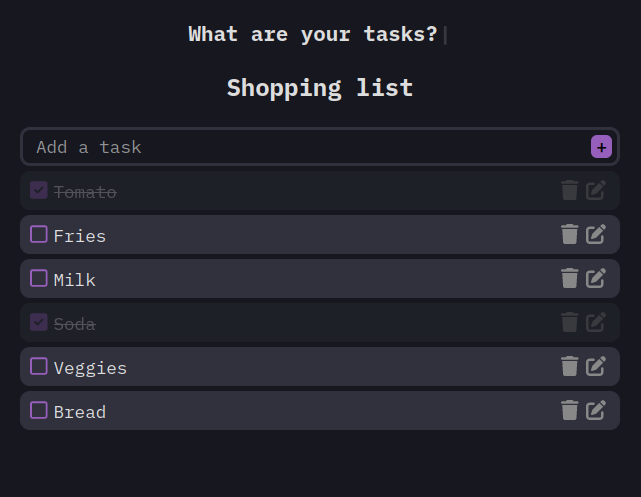

# ToDo App

Welcome to the ToDo App repository! This project is a simple ToDo application that helps you manage your daily tasks. 

## Table of Contents

- [ToDo App](#todo-app)
  - [Table of Contents](#table-of-contents)
  - [About](#about)
  - [Features](#features)
  - [Technologies Used](#technologies-used)
  - [Installation](#installation)
  - [Usage](#usage)
  - [Contributing](#contributing)
  - [Screenshots](#screenshots)

## About

The ToDo App is designed to help users keep track of their tasks and to-do lists in an organized manner. It features an easy-to-use interface, making task management simple and efficient.

## Features

- Add new tasks
- Edit existing tasks
- Delete tasks
- Mark tasks as completed
- Still in progress: Filter tasks by status (all, completed, pending)

## Technologies Used

This project was built using the following technologies:
- React
- JavaScript
- CSS

## Installation

To run this project locally, follow these steps:

1. Clone the repository:
    ```bash
    git clone git@github.com:estefaniaramirezmnt/react-todo-app-personal.git
    ```

2. Navigate to the project directory:
    ```bash
    cd react-todo-app-personal
    ```

3. Go to the `src` directory:
    ```bash
    cd src
    ```
4. Install the dependencies:
    ```bash
    npm install
    ```
5. Start the development server:
    ```bash
    npm start
    ```
    
## Usage

- **Add Task:** Enter your task in the input field and click the "Add" button to add a new task.
- **Edit Task:** Click on the task you want to edit, make changes, and press "Enter" to save.
- **Delete Task:** Click the "Delete" button next to the task to remove it.
- **Mark as Completed:** Click the checkbox next to the task to mark it as completed.
- **Filter Tasks:** (Still in progress). Use the filter options to view all tasks, only completed tasks, or only pending tasks.

## Contributing

If you would like to contribute to this project, please follow these steps:

1. Fork the repository.
2. Create a new branch (`git checkout -b feature/YourFeature`).
3. Make your changes.
4. Commit your changes (`git commit -m 'Add some feature'`).
5. Push to the branch (`git push origin feature/YourFeature`).
6. Open a pull request.

## Screenshots

